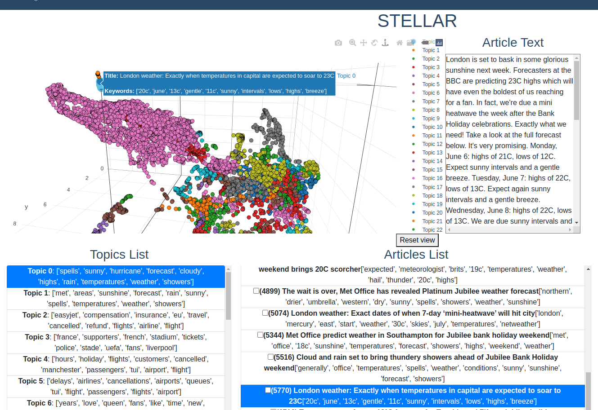

# STELLAR

## Introduction
This is the app for doing Systematic Topic Evaluation Leveraging Lists of ARticles.




## Setup & Installation
```bash
git clone <repo-url>
```

```bash
pip install -r requirements.txt
```

## Files required
Two files are required to run the app. 
1. articles_df.csv
- The articles and their labels. Must contain the columns ["text", "title", "keywords", "label", "x", "y", "z"]
2. topics_df.csv
- The topics list. Must contain the columns ["topic_id", "keywords"] 


## Running The App

```bash
python main.py
```

## Viewing The App

Go to `http://127.0.0.1:5000/`


## Dataset 
Demo news data from BBC news from D. Greene and P. Cunningham.
"Practical Solutions to the Problem of Diagonal Dominance in Kernel Document Clustering", Proc. ICML 2006.

http://mlg.ucd.ie/datasets/bbc.html

** Note that this dataset is not the same industry dataset that was used in the original article. This is only for demo purposes. **

## Instructions to prepare for human evaluation
### Coming soon.


## Instructions human evaluation
For each Topic in Topics List
1. Click on the Topic in the Topic list.
2. Notice the keywords describing the Topic. 
3. Read the article titles (and keywords if needed). 
- Click on the article to read the body if not clear what the topic is about.
4. Choose the main topic from the list. A topic in the list can be chosen multiple times.
- If you can’t find a topic that includes 50% of the articles, then choose “Incoherent topic”. 
- If you don’t agree with any of the topics in the list, write “custom” and then in the notes write your custom topic.
5. Check the checkbox for articles that do not belong to the topic.

